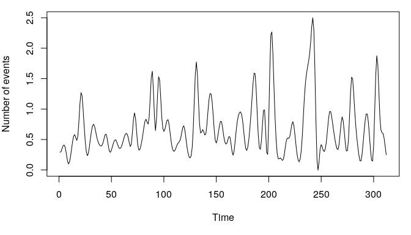
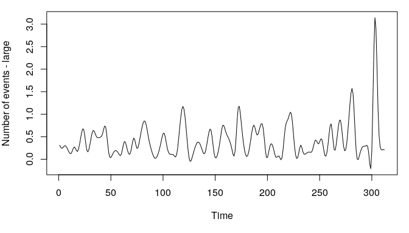
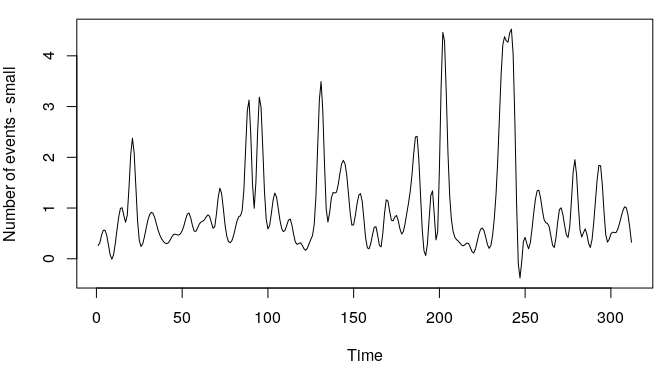
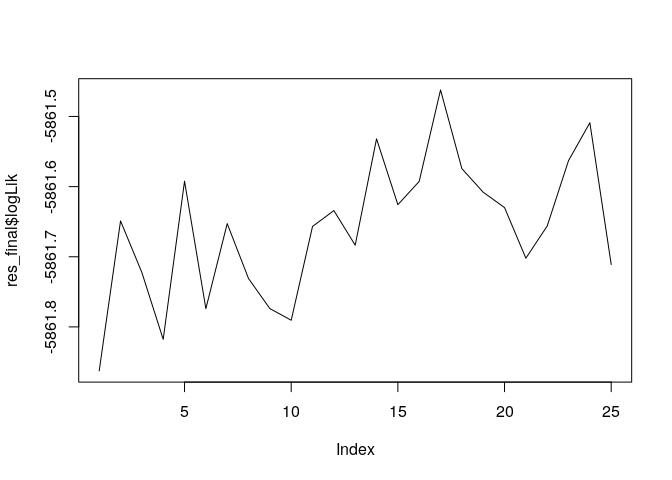
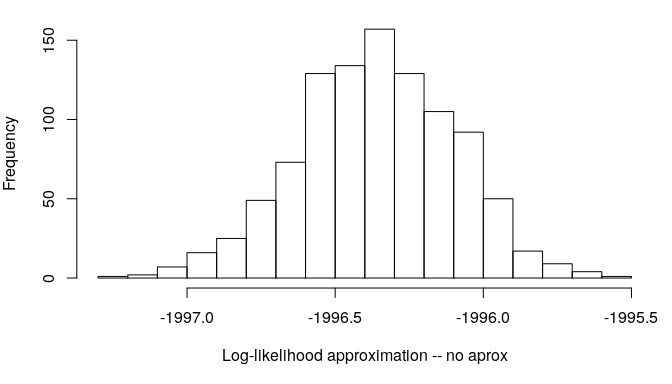
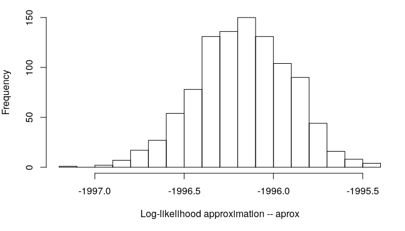

Multivariate State Space Models
===============================

[](https://travis-ci.org/boennecd/mssm)

This package provides methods to estimate models of the form

,\qquad i\in I_t")


")

where  is simple distribution, we observe  periods, and , , , and  are known. What is multivariate is  (though,  can also be multivariate) and this package is written to scale well in the dimension of . The package uses independent particle filters as suggested by Lin et al. (2005). This particular type of filter can be used in the method suggested by Poyiadjis, Doucet, and Singh (2011). I will show an example of how to use the package through the rest of the document and highlight some implementation details.

The package is not on CRAN but it can be installed from Github e.g., by calling

``` r
devtools::install_github("boennecd/mssm")
```

Table of Contents
-----------------

-   [Multivariate State Space Models](#multivariate-state-space-models)
    -   [Poisson Example](#poisson-example)
        -   [Log-Likelihood Approximations](#log-likelihood-approximations)
        -   [Parameter Estimation](#parameter-estimation)
        -   [Faster Approximation](#faster-approximation)
        -   [Approximate Observed Information Matrix](#approximate-observed-information-matrix)
    -   [Supported Families](#supported-families)
    -   [Fast Sum-Kernel Approximation](#fast-sum-kernel-approximation)
    -   [Function Definitions](#function-definitions)
-   [References](#references)

Poisson Example
---------------

We simulate data as follows.

``` r
# simulate path of state variables 
set.seed(78727269)
n_periods <- 312L
(F. <- matrix(c(.5, .1, 0, .8), 2L))
```

    ##      [,1] [,2]
    ## [1,]  0.5  0.0
    ## [2,]  0.1  0.8

``` r
(Q <- matrix(c(.5^2, .1, .1, .7^2), 2L))
```

    ##      [,1] [,2]
    ## [1,] 0.25 0.10
    ## [2,] 0.10 0.49

``` r
(Q_0 <- matrix(c(0.333, 0.194, 0.194, 1.46), 2L))
```

    ##       [,1]  [,2]
    ## [1,] 0.333 0.194
    ## [2,] 0.194 1.460

``` r
betas <- cbind(crossprod(chol(Q_0),        rnorm(2L)                      ), 
               crossprod(chol(Q  ), matrix(rnorm((n_periods - 1L) * 2), 2)))
betas <- t(betas)
for(i in 2:nrow(betas))
  betas[i, ] <- betas[i, ] + F. %*% betas[i - 1L, ]
par(mar = c(5, 4, 1, 1))
matplot(betas, lty = 1, type = "l")
```


``` r
# simulate observations
cfix <- c(-1, .2, .5, -1) # gamma
n_obs <- 100L
dat <- lapply(1:n_obs, function(id){
  x <- runif(n_periods, -1, 1)
  X <- cbind(X1 = x, X2 = runif(1, -1, 1))
  z <- runif(n_periods, -1, 1)
  
  eta <- drop(cbind(1, X, z) %*% cfix + rowSums(cbind(1, z) * betas))
  y <- rpois(n_periods, lambda = exp(eta))
  
  # randomly drop some
  keep <- .2 > runif(n_periods)
  
  data.frame(y = y, X, Z = z, id = id, time_idx = 1:n_periods)[keep, ]
})
dat <- do.call(rbind, dat)

# show some properties 
nrow(dat)
```

    ## [1] 6242

``` r
head(dat)
```

    ##    y      X1     X2       Z id time_idx
    ## 2  0  0.5685 0.9272  0.9845  1        2
    ## 3  0 -0.2260 0.9272  0.1585  1        3
    ## 4  1 -0.7234 0.9272  0.4847  1        4
    ## 5  1 -0.3010 0.9272 -0.6352  1        5
    ## 8  2 -0.4437 0.9272  0.8311  1        8
    ## 13 1  0.2834 0.9272  0.7135  1       13

``` r
table(dat$y)
```

    ## 
    ##    0    1    2    3    4    5    6    7    8    9   10   11   12   13   14 
    ## 3881 1479  486  180   83   54   32    8    7    6    6    2    3    3    2 
    ##   15   16   17   20   21   24   26   28 
    ##    2    1    1    2    1    1    1    1

``` r
# quick smooth of number of events vs. time
par(mar = c(5, 4, 1, 1))
plot(smooth.spline(dat$time_idx, dat$y), type = "l", xlab = "Time", 
     ylab = "Number of events")
```



``` r
# and split by those with `Z` above and below 0
with(dat, {
  z_large <- ifelse(Z > 0, "large", "small")
  smooths <- lapply(split(cbind(dat, z_large), z_large), function(x){
    plot(smooth.spline(x$time_idx, x$y), type = "l", xlab = "Time", 
     ylab = paste("Number of events -", unique(x$z_large)))
  })
})
```



In the above, we simulate 312 (`n_periods`) with 100 (`n_obs`) individuals. Each individual has a fixed covariate, `X2`, and two time-varying covariates, `X1` and `Z`. One of the time-varying covariates, `Z`, has a random slope. Further, the intercept is also random.

### Log-Likelihood Approximations

We start by estimating a generalized linear model without random effects.

``` r
glm_fit <- glm(y ~ X1 + X2 + Z, poisson(), dat)
summary(glm_fit)
```

    ## 
    ## Call:
    ## glm(formula = y ~ X1 + X2 + Z, family = poisson(), data = dat)
    ## 
    ## Deviance Residuals: 
    ##    Min      1Q  Median      3Q     Max  
    ## -2.266  -1.088  -0.767   0.395  10.913  
    ## 
    ## Coefficients:
    ##             Estimate Std. Error z value Pr(>|z|)    
    ## (Intercept)  -0.5558     0.0180  -30.82  < 2e-16 ***
    ## X1            0.2024     0.0265    7.62  2.4e-14 ***
    ## X2            0.5160     0.0275   18.78  < 2e-16 ***
    ## Z            -0.9122     0.0286  -31.90  < 2e-16 ***
    ## ---
    ## Signif. codes:  0 '***' 0.001 '**' 0.01 '*' 0.05 '.' 0.1 ' ' 1
    ## 
    ## (Dispersion parameter for poisson family taken to be 1)
    ## 
    ##     Null deviance: 10989.1  on 6241  degrees of freedom
    ## Residual deviance:  9427.1  on 6238  degrees of freedom
    ## AIC: 14977
    ## 
    ## Number of Fisher Scoring iterations: 6

``` r
logLik(glm_fit)
```

    ## 'log Lik.' -7485 (df=4)

Next, we make a log-likelihood approximation with the implemented particle at the true parameters with the `mssm` function.

``` r
library(mssm)
ll_func <- mssm(
  fixed = y ~ X1 + X2 + Z, family = poisson(), data = dat, 
  # make it explict that there is an intercept (not needed)
  random = ~ 1 + Z, ti = time_idx, control = mssm_control(
    n_threads = 5L, N_part = 500L, what = "log_density"))

system.time(
  mssm_obj <- ll_func$pf_filter(
    cfix = cfix, disp = numeric(), F. = F., Q = Q))
```

    ##    user  system elapsed 
    ##   1.898   0.025   0.479

``` r
# returns the log-likelihood approximation
logLik(mssm_obj)
```

    ## 'log Lik.' -5865 (df=NA)

We get a much larger log-likelihood as expected. We can plot the predicted values of state variables from the filter distribution.

``` r
# get predicted mean and prediction interval 
filter_means <- plot(mssm_obj, do_plot = FALSE)

# plot with which also contains the true paths
for(i in 1:ncol(betas)){
  be <- betas[, i]
  me <- filter_means$means[i, ]
  lb <- filter_means$lbs[i, ]
  ub <- filter_means$ubs[i, ]
  
  #     dashed: true paths
  # continuous: predicted mean from filter distribution 
  #     dotted: prediction interval
  par(mar = c(5, 4, 1, 1))
  matplot(cbind(be, me, lb, ub), lty = c(2, 1, 3, 3), type = "l", 
          col = "black", ylab = rownames(filter_means$lbs)[i])
}
```


We can get the effective sample size at each point in time with the `get_ess` function.

``` r
(ess <- get_ess(mssm_obj))
```

    ## Effective sample sizes
    ##   Mean      458.4
    ##   sd         22.1
    ##   Min       325.7
    ##   Max       484.8

``` r
plot(ess)
```


We can compare this what we get by using a so-called bootstrap (like) filter instead.

``` r
local({
  ll_boot <- mssm(
    fixed = y ~ X1 + X2 + Z, family = poisson(), data = dat, 
    random = ~ Z, ti = time_idx, control = mssm_control(
      n_threads = 5L, N_part = 500L, what = "log_density", 
      which_sampler = "bootstrap"))
  
  print(system.time(
    boot_fit <- ll_boot$pf_filter(
      cfix = coef(glm_fit), disp = numeric(), F. = F., Q = Q)))
  
  plot(get_ess(boot_fit))
})
```

    ##    user  system elapsed 
    ##   1.901   0.013   0.476


The above is not much faster (and maybe slower in this run) as the bulk of the computation is not in the sampling step. We can also compare the log-likelihood approximation with what we get if we choose parameters close to the GLM estimates.

``` r
mssm_glm <- ll_func$pf_filter(
  cfix = coef(glm_fit), disp = numeric(), F. = diag(1e-8, 2), 
  Q = diag(1e-4^2, 2))
logLik(mssm_glm)
```

    ## 'log Lik.' -7485 (df=NA)

### Parameter Estimation

We will need to estimate the parameters for real applications. We could do this e.g., with a Monte Carlo expectation-maximization algorithm or by using a Monte Carlo approximation of the gradient. Currently, the latter is only available and the user will have to write a custom function to perform the estimation. I will provide an example below. The `sgd` function is not a part of the package. Instead the package provides a way to approximate the gradient and allows the user to perform subsequent maximization (e.g., with constraints or penalties). The definition of the `sgd` is given at the end of this file as it is somewhat long.

``` r
# setup mssmFunc object to use
ll_func <- mssm(  
  fixed = y ~ X1 + X2 + Z, family = poisson(), data = dat, 
  random = ~ Z, ti = time_idx, control = mssm_control(
    n_threads = 5L, N_part = 200L, what = "gradient"))

# use stochastic gradient descent with averaging
set.seed(25164416)
system.time( 
  res <- sgd(
    ll_func, F. = diag(.5, 2), Q = diag(1, 2), cfix = coef(glm_fit), 
    lrs = .001 * (1:150L)^(-1/2)))
```

    ##    user  system elapsed 
    ## 638.295   3.821 147.706

``` r
# use Adam algorithm instead
set.seed(25164416)
system.time( 
  resa <- adam(
    ll_func, F. = diag(.5, 2), Q = diag(2, 2), cfix = coef(glm_fit), 
    lr = .1))
```

    ##    user  system elapsed 
    ## 642.249   3.801 148.648

A plot of the approximate log-likelihoods at each iteration is shown below along with the final estimates.

``` r
print(tail(res$logLik), digits = 6) # final log-likelihood approximations
```

    ## [1] -5863.35 -5862.56 -5862.44 -5862.15 -5862.63 -5861.82

``` r
par(mar = c(5, 4, 1, 1))
plot(     res$logLik       , type = "l")
```


``` r
plot(tail(res$logLik, 100L), type = "l") # only the final iterations
```


``` r
# final estimates
res$F. 
```

    ##          [,1]      [,2]
    ## [1,]  0.49526 -0.006995
    ## [2,] -0.01311  0.784075

``` r
res$Q
```

    ##        [,1]   [,2]
    ## [1,] 0.3131 0.1474
    ## [2,] 0.1474 0.5575

``` r
res$cfix
```

    ## [1] -0.9840  0.2137  0.5243 -0.8962

``` r
# compare with output from Adam algorithm
print(tail(resa$logLik), digits = 6) # final log-likelihood approximations
```

    ## [1] -5863.45 -5862.35 -5862.27 -5861.88 -5862.50 -5861.70

``` r
plot(resa$logLik       , type = "l")
```


``` r
resa$F. 
```

    ##          [,1]     [,2]
    ## [1,] 0.499976 -0.00433
    ## [2,] 0.004879  0.79736

``` r
resa$Q
```

    ##       [,1]   [,2]
    ## [1,] 0.306 0.1350
    ## [2,] 0.135 0.5029

``` r
resa$cfix
```

    ## [1] -0.9837  0.2110  0.5205 -1.0333

We may want to use more particles towards the end when we estimate the parameters. To do, we use the approximation described in the next section at the final estimates that we arrived at before.

``` r
ll_func <- mssm(
  fixed = y ~ X1 + X2 + Z, family = poisson(), data = dat, 
  random = ~ Z, ti = time_idx, control = mssm_control(
    n_threads = 5L, N_part = 10000L, what = "gradient",
    which_ll_cp = "KD", aprx_eps = .01))

set.seed(25164416)
system.time( 
  res_final <- sgd(
    ll_func, F. = resa$F., Q = resa$Q, cfix = resa$cfix, 
    lrs = rep(.0001, 25L), n_it = 25L))
```

    ##    user  system elapsed 
    ## 3049.97   27.44  676.39

``` r
plot(res_final$logLik, type = "l")
```



``` r
res_final$F. 
```

    ##          [,1]      [,2]
    ## [1,] 0.500744 -0.002725
    ## [2,] 0.003564  0.799376

``` r
res_final$Q
```

    ##        [,1]   [,2]
    ## [1,] 0.3064 0.1282
    ## [2,] 0.1282 0.5030

``` r
res_final$cfix
```

    ## [1] -0.9864  0.2135  0.5241 -1.0262

### Faster Approximation

One drawback with the particle filter we use is that it has ") computational complexity where  is the number of particles. We can see this by changing the number of particles.

``` r
local({
  # assign function that returns a function that uses a given number of 
  # particles
  func <- function(N){
    ll_func <- mssm(
      fixed = y ~ X1 + X2 + Z, family = poisson(), data = dat, 
      random = ~ Z, ti = time_idx, control = mssm_control(
        n_threads = 5L, N_part = N, what = "log_density"))
    function()
      ll_func$pf_filter(
        cfix = coef(glm_fit), disp = numeric(), F. = diag(1e-8, 2), 
        Q = diag(1e-4^2, 2))
      
  }
  
  f_100  <- func( 100L)
  f_200  <- func( 200L)
  f_400  <- func( 400L)
  f_800  <- func( 800L)
  f_1600 <- func(1600L)
  
  # benchmark. Should ĩncrease at ~ N^2 rate
  microbenchmark::microbenchmark(
    `100` = f_100(), `200` = f_200(), `400` = f_400(), `800` = f_800(),
    `1600` = f_1600(), times = 3L)
})
```

    ## Unit: milliseconds
    ##  expr    min      lq    mean  median      uq     max neval
    ##   100   61.1   61.33   62.67   61.56   63.46   65.35     3
    ##   200  127.0  128.83  131.17  130.68  133.26  135.83     3
    ##   400  350.9  351.96  355.86  353.04  358.35  363.65     3
    ##   800 1010.6 1039.94 1054.21 1069.23 1075.99 1082.76     3
    ##  1600 3370.2 3379.06 3398.45 3387.90 3412.56 3437.22     3

A solution is to use the dual k-d tree method I cover later. The computational complexity is ") for this method which is somewhat indicated by the run times shown below.

``` r
local({
  # assign function that returns a function that uses a given number of 
  # particles
  func <- function(N){
    ll_func <- mssm(
      fixed = y ~ X1 + X2 + Z, family = poisson(), data = dat, 
      random = ~ Z, ti = time_idx, control = mssm_control(
        n_threads = 5L, N_part = N, what = "log_density", 
        which_ll_cp = "KD", KD_N_max = 6L, aprx_eps = 1e-2))
    function()
      ll_func$pf_filter(
        cfix = coef(glm_fit), disp = numeric(), F. = diag(1e-8, 2), 
        Q = diag(1e-4^2, 2))
      
  }
  
  f_100   <- func(  100L)
  f_200   <- func(  200L)
  f_400   <- func(  400L)
  f_800   <- func(  800L)
  f_1600  <- func( 1600L)
  f_12800 <- func(12800L) # <-- much larger
  
  # benchmark. Should increase at ~ N log N rate
  microbenchmark::microbenchmark(
    `100` = f_100(), `200` = f_200(), `400` = f_400(), `800` = f_800(), 
    `1600` = f_1600(), `12800` = f_12800(), times = 3L)
})
```

    ## Unit: milliseconds
    ##   expr    min     lq   mean median     uq    max neval
    ##    100  106.6  106.7  108.7  106.9  109.8  112.7     3
    ##    200  192.0  199.8  207.6  207.6  215.3  223.1     3
    ##    400  410.1  415.4  418.0  420.7  422.0  423.4     3
    ##    800  841.6  841.7  843.4  841.8  844.3  846.9     3
    ##   1600 1506.0 1532.5 1549.5 1559.1 1571.3 1583.4     3
    ##  12800 8831.0 8853.0 8886.2 8875.1 8913.8 8952.6     3

The `aprx_eps` controls the size of the error. To be precise about what this value does then we need to some notation for the complete likelihood (the likelihood where we observe s). This is

g_1(\vec y_1 \mid \vec \beta_1)\prod_{t=2}^Tf(\vec\beta_t \mid\vec\beta_{t-1})g_t(y_t\mid\beta_t)")

where  is conditional distribution  given ,  is the conditional distribution of  given , and  is the time-invariant distribution of . Let }") be the weight of particle  at time  and }") be the th particle at time . Then we ensure the error in our evaluation of terms }f(\vec\beta_t^{(i)} \mid \vec\beta_{t-1}^{(j)})") never exceeds

/2}")

 where  and  are respectively an upper and lower bound of } \mid \vec\beta_{t-1}^{(j)})"). The question is how big the error is. Thus, we consider the error in the log-likelihood approximation at the true parameters.

``` r
ll_compare <- local({
  N_use <- 500L 
  # we alter the seed in each run. First, the exact method
  ll_no_approx <- sapply(1:200, function(seed){
    ll_func <- mssm(
      fixed = y ~ X1 + X2 + Z, family = poisson(), data = dat,
      random = ~ Z, ti = time_idx, control = mssm_control(
        n_threads = 5L, N_part = N_use, what = "log_density", 
        seed = seed))
    
    logLik(ll_func$pf_filter(
      cfix = cfix, disp = numeric(), F. = F., Q = Q))
  })
  
  # then the approximation
  ll_approx <- sapply(1:200, function(seed){
    ll_func <- mssm(
      fixed = y ~ X1 + X2 + Z, family = poisson(), data = dat,
      random = ~ Z, ti = time_idx, control = mssm_control(
        n_threads = 5L, N_part = N_use, what = "log_density", 
        KD_N_max = 6L, aprx_eps = 1e-2, seed = seed, 
        which_ll_cp = "KD"))
    
    logLik(ll_func$pf_filter(
      cfix = cfix, disp = numeric(), F. = F., Q = Q))
  })
  
  list(ll_no_approx = ll_no_approx, ll_approx = ll_approx)
})
```

``` r
par(mar = c(5, 4, 1, 1))
hist(
  ll_compare$ll_no_approx, main = "", breaks = 20L, 
  xlab = "Log-likelihood approximation -- no aprox")
```



``` r
hist(
  ll_compare$ll_approx   , main = "", breaks = 20L, 
  xlab = "Log-likelihood approximation -- aprox")
```



We can make a t-test for whether there is a difference between the two log-likelihood estimates

``` r
with(ll_compare, t.test(ll_no_approx, ll_approx))
```

    ## 
    ##  Welch Two Sample t-test
    ## 
    ## data:  ll_no_approx and ll_approx
    ## t = -8.9, df = 400, p-value <2e-16
    ## alternative hypothesis: true difference in means is not equal to 0
    ## 95 percent confidence interval:
    ##  -0.5457 -0.3479
    ## sample estimates:
    ## mean of x mean of y 
    ##     -5864     -5864

The fact that there may only be a small difference if any is nice because now we can get a much better approximation (in terms of variance) quickly of e.g., the log-likelihood as shown below.

``` r
ll_approx <- sapply(1:10, function(seed){
  N_use <- 10000L # many more particles
  
  ll_func <- mssm(
    fixed = y ~ X1 + X2 + Z, family = poisson(), data = dat,
    random = ~ Z, ti = time_idx, control = mssm_control(
      n_threads = 5L, N_part = N_use, what = "log_density", 
      KD_N_max = 100L, aprx_eps = 1e-2, seed = seed, 
      which_ll_cp = "KD"))
  
  logLik(ll_func$pf_filter(
    cfix = cfix, disp = numeric(), F. = F., Q = Q))
}) 

# approximate log-likelihood
sd(ll_approx)
```

    ## [1] 0.1091

``` r
print(mean(ll_approx), digits = 6)
```

    ## [1] -5863.97

``` r
# compare sd with 
sd(ll_compare$ll_no_approx)
```

    ## [1] 0.5033

``` r
print(mean(ll_compare$ll_no_approx), digits = 6)
```

    ## [1] -5864.42

### Approximate Observed Information Matrix

Next, we look at approximating the observed information matrix with the method suggested by Poyiadjis, Doucet, and Singh (2011).

``` r
ll_func <- mssm(
  fixed = y ~ X1 + X2 + Z, family = poisson(), data = dat,
  random = ~ Z, ti = time_idx, control = mssm_control(
    n_threads = 5L, N_part = 10000L, what = "Hessian",
    which_ll_cp = "KD", aprx_eps = .01))

set.seed(46658529)
system.time(
  mssm_obs_info <- ll_func$pf_filter(
    cfix = res_final$cfix, disp = numeric(), F. = res_final$F., 
    Q = res_final$Q))
```

    ##    user  system elapsed 
    ## 286.072   1.332  61.472

We define a function below to get the gradient and approximate the observed information matrix from the returned output. Then we compare the output to the GLM we estimated and to the true parameters.

``` r
# Function to subtract the gradient elements and diagonal block  
# matrices of the approximate observed information matrix. 
# 
# Args:
#   object: an object of class mssm.
#
# Returns:
#   approximate gradient elements and diagonal block matrices of the 
#   approximate observed information matrix. 
get_grad_n_obs_info <- function(object){
  stopifnot(inherits(object, "mssm"))

  # get dimension of the different components
  n_fix <- nrow(object$X)
  n_rng <- nrow(object$Z)
  dim_fix <- n_fix
  dim_F   <- n_rng * n_rng
  dim_Q   <- (n_rng * (n_rng  + 1L)) / 2L


  # get quantities for each particle
  quants <- tail(object$pf_output, 1L)[[1L]]$stats
  ws     <- tail(object$pf_output, 1L)[[1L]]$ws_normalized

  # get mean estimates
  meas <- colSums(t(quants) * drop(exp(ws)))

  # separate out the different components. Start with parameters for
  # the conditional density of the outcome given the state vector
  idx <- 1:n_fix
  dg  <- meas[idx]
  idx <- max(idx) + 1:(n_fix * n_fix)
  ddg <- matrix(meas[idx], n_fix, n_fix)

  # then the parameters for the conditional density of the state vector given
  # the previous
  idx <- max(idx) + 1:(dim_F + dim_Q)
  df <- meas[idx]
  idx <- max(idx) + 1:((dim_F + dim_Q) * (dim_F + dim_Q))
  ddf <- matrix(meas[idx], dim_F + dim_Q, dim_F + dim_Q)

  list(dg = dg, ddg = ddg, df = df, ddf = ddf)
}

# use function
out <- get_grad_n_obs_info(mssm_obs_info)

# Look at output for parameters in the observational equation
out$dg # approximate gradient
```

    ## [1] -0.6439  0.1699  0.4309  2.8808

``` r
(cvov_fit <- solve(-out$ddg)) # inverse negative observed information matrix
```

    ##             [,1]         [,2]         [,3]        [,4]
    ## [1,]  0.00185387 -0.000049966 -0.000131756 0.001814648
    ## [2,] -0.00004997  0.000792356  0.000002176 0.000003696
    ## [3,] -0.00013176  0.000002176  0.000852571 0.000014141
    ## [4,]  0.00181465  0.000003696  0.000014141 0.007585649

``` r
(ses <- sqrt(diag(cvov_fit))) # approximate standard errors
```

    ## [1] 0.04306 0.02815 0.02920 0.08710

``` r
# compare with glm model
(cvov_fit <- vcov(glm_fit))
```

    ##             (Intercept)           X1           X2          Z
    ## (Intercept)  0.00032520 -0.000041949 -0.000117913 0.00024162
    ## X1          -0.00004195  0.000704501  0.000002523 0.00001204
    ## X2          -0.00011791  0.000002523  0.000754839 0.00002072
    ## Z            0.00024162  0.000012044  0.000020717 0.00081774

``` r
sqrt(diag(cvov_fit))
```

    ## (Intercept)          X1          X2           Z 
    ##     0.01803     0.02654     0.02747     0.02860

``` r
# and relative to true parameters vs. estimated
rbind(true = cfix, glm = coef(glm_fit), mssm = res_final$cfix, se = ses)
```

    ##      (Intercept)      X1     X2       Z
    ## true    -1.00000 0.20000 0.5000 -1.0000
    ## glm     -0.55576 0.20237 0.5160 -0.9122
    ## mssm    -0.98639 0.21349 0.5241 -1.0262
    ## se       0.04306 0.02815 0.0292  0.0871

``` r
# next look at parameters in state equation
out$df # approximate gradient
```

    ## [1]  0.2519 -0.4234  0.6508  0.2961 -0.4528 -1.1871 -0.4186

``` r
(cvov_fit <- solve(-out$ddf)) # inverse negative observed information matrix
```

    ##            [,1]       [,2]         [,3]        [,4]         [,5]
    ## [1,]  0.0045581  0.0021530 -0.000608281 -0.00029388 -0.000665520
    ## [2,]  0.0021530  0.0082830 -0.000268899 -0.00087664 -0.000555822
    ## [3,] -0.0006083 -0.0002689  0.001075594  0.00045397 -0.000001381
    ## [4,] -0.0002939 -0.0008766  0.000453968  0.00175210  0.000011931
    ## [5,] -0.0006655 -0.0005558 -0.000001381  0.00001193  0.001329710
    ## [6,] -0.0002382 -0.0010363 -0.000239156 -0.00016653  0.000706379
    ## [7,] -0.0000593 -0.0007590 -0.000208198 -0.00103359  0.000358747
    ##            [,6]       [,7]
    ## [1,] -0.0002382 -0.0000593
    ## [2,] -0.0010363 -0.0007590
    ## [3,] -0.0002392 -0.0002082
    ## [4,] -0.0001665 -0.0010336
    ## [5,]  0.0007064  0.0003587
    ## [6,]  0.0016094  0.0013579
    ## [7,]  0.0013579  0.0050765

``` r
(ses <- sqrt(diag(cvov_fit))) # approximate standard errors
```

    ## [1] 0.06751 0.09101 0.03280 0.04186 0.03647 0.04012 0.07125

``` r
# first four are for F. Estimate vs. true values are given below
rbind(true = c(F.), mssm = c(res_final$F.), se = ses[1:4])
```

    ##         [,1]     [,2]      [,3]    [,4]
    ## true 0.50000 0.100000  0.000000 0.80000
    ## mssm 0.50074 0.003564 -0.002725 0.79938
    ## se   0.06751 0.091011  0.032796 0.04186

``` r
# next three are w.r.t. the lower diagonal part of Q
rbind(
  true =           Q[lower.tri(Q, diag = TRUE)], 
  mssm = res_final$Q[lower.tri(Q, diag = TRUE)], 
  se = ses[5:7])
```

    ##         [,1]    [,2]    [,3]
    ## true 0.25000 0.10000 0.49000
    ## mssm 0.30645 0.12821 0.50302
    ## se   0.03647 0.04012 0.07125

Supported Families
------------------

The following families are supported:

-   The binomial distribution is supported with logit, probit, and cloglog link.
-   The Poisson distribution is supported with square root and log link.
-   The gamma distribution is supported with log link.

Fast Sum-Kernel Approximation
-----------------------------

This package contains a simple implementation of the dual-tree method like the one suggested by Gray and Moore (2003) and shown in Klaas et al. (2006). The problem we want to solve is the sum-kernel problem in Klaas et al. (2006). Particularly, we consider the situation where we have  query particles denoted by  and  source particles denoted by . For each query particle, we want to compute the weights

")

where each source particle has an associated weight  and  is a kernel. Computing the above is ") which is major bottleneck if  and  is large. However, one can use a [k-d tree](https://en.wikipedia.org/wiki/K-d_tree) for the query particles and source particles and exploit that:

-   ") is almost zero for some pairs of nodes in the two k-d trees.
-   ") is almost identical for some nodes in the k-d tree for the source particles.

Thus, a substantial amount of computation can be skipped or approximated with e.g., the centroid in the source node with only a minor loss of precision. The dual-tree approximation method is ") and "). We start by defining a function to simulate the source and query particles (we will let the two sets be identical for simplicity). Further, we plot one draw of simulated points and illustrate the leafs in the k-d tree.

``` r
######
# define function to simulate data
mus <- matrix(c(-1, -1, 
                 1, 1, 
                -1, 1), 3L, byrow = FALSE)
mus <- mus * .75
Sig <- diag(c(.5^2, .25^2))

get_sims <- function(n_per_grp){
  # simulate X
  sims <- lapply(1:nrow(mus), function(i){
    mu <- mus[i, ]
    X <- matrix(rnorm(n_per_grp * 2L), nrow = 2L)
    X <- t(crossprod(chol(Sig), X) + mu)
    
    data.frame(X, grp = i)
  })
  sims <- do.call(rbind, sims)
  X <- t(as.matrix(sims[, c("X1", "X2")]))
  
  # simulate weights
  ws <- exp(rnorm(ncol(X)))
  ws <- ws / sum(ws)
  
  list(sims = sims, X = X, ws = ws)
}

#####
# show example 
set.seed(42452654)
invisible(list2env(get_sims(5000L), environment()))

# plot points
par(mar = c(5, 4, 1, 1))
plot(as.matrix(sims[, c("X1", "X2")]), col = sims$grp + 1L)

# find k-d tree and add borders 
out <- mssm:::test_KD_note(X, 50L)
out$indices <- out$indices + 1L
n_ele <- drop(out$n_elems)
idx <- mapply(`:`, cumsum(c(1L, head(n_ele, -1))), cumsum(n_ele))
stopifnot(all(sapply(idx, length) == n_ele))
idx <- lapply(idx, function(i) out$indices[i])
stopifnot(!anyDuplicated(unlist(idx)), length(unlist(idx)) == ncol(X))

grps <- lapply(idx, function(i) X[, i])

borders <- lapply(grps, function(x) apply(x, 1, range))
invisible(lapply(borders, function(b) 
  rect(b[1, "X1"], b[1, "X2"], b[2, "X1"], b[2, "X2"])))
```


Next, we compute the run-times for the previous examples and compare the approximations of the un-normalized log weights, , and normalized weights, . The `n_threads` sets the number of threads to use in the methods.

``` r
# run-times
microbenchmark::microbenchmark(
  `dual tree 1` = mssm:::FSKA (X = X, ws = ws, Y = X, N_min = 10L, 
                               eps = 5e-3, n_threads = 1L),
  `dual tree 4` = mssm:::FSKA (X = X, ws = ws, Y = X, N_min = 10L, 
                               eps = 5e-3, n_threads = 4L),
  `naive 1`     = mssm:::naive(X = X, ws = ws, Y = X, n_threads = 1L),
  `naive 4`     = mssm:::naive(X = X, ws = ws, Y = X, n_threads = 4L),
  times = 10L)
```

    ## Unit: milliseconds
    ##         expr     min      lq    mean  median      uq     max neval
    ##  dual tree 1  103.52  105.13  111.10  110.86  115.91  121.33    10
    ##  dual tree 4   40.01   40.21   42.98   42.51   45.42   46.77    10
    ##      naive 1 3315.93 3345.30 3483.81 3378.50 3470.81 4273.35    10
    ##      naive 4  937.60 1030.78 1098.48 1045.87 1157.48 1313.02    10

``` r
# The functions return the un-normalized log weights. We first compare
# the result on this scale
o1 <- mssm:::FSKA  (X = X, ws = ws, Y = X, N_min = 10L, eps = 5e-3, 
                    n_threads = 1L)
o2 <- mssm:::naive(X = X, ws = ws, Y = X, n_threads = 4L)

all.equal(o1, o2)
```

    ## [1] "Mean relative difference: 0.0015"

``` r
par(mar = c(5, 4, 1, 1))
hist((o1 - o2)/ abs((o1 + o2) / 2), breaks = 50, main = "", 
     xlab = "Delta un-normalized log weights")
```


``` r
# then we compare the normalized weights
func <- function(x){
  x_max <- max(x)
  x <- exp(x - x_max)
  x / sum(x)
}

o1 <- func(o1)
o2 <- func(o2)
all.equal(o1, o2)
```

    ## [1] "Mean relative difference: 0.0008531"

``` r
hist((o1 - o2)/ abs((o1 + o2) / 2), breaks = 50, main = "", 
     xlab = "Delta normalized log weights")
```


Finally, we compare the run-times as function of . The dashed line is "naive" method, the continuous line is the dual-tree method, and the dotted line is dual-tree method using 1 thread.

``` r
Ns <- 2^(7:14)
run_times <- lapply(Ns, function(N){ 
  invisible(list2env(get_sims(N), environment()))
  microbenchmark::microbenchmark(
    `dual-tree`   = mssm:::FSKA (X = X, ws = ws, Y = X, N_min = 10L, eps = 5e-3, 
                                 n_threads = 4L),
    naive         = mssm:::naive(X = X, ws = ws, Y = X, n_threads = 4L),
    `dual-tree 1` = mssm:::FSKA (X = X, ws = ws, Y = X, N_min = 10L, eps = 5e-3, 
                                 n_threads = 1L), 
    times = 5L)
}) 

Ns_xtra <- 2^(15:19) 
run_times_xtra <- lapply(Ns_xtra, function(N){
  invisible(list2env(get_sims(N), environment()))
  microbenchmark::microbenchmark(
    `dual-tree` = mssm:::FSKA (X = X, ws = ws, Y = X, N_min = 10L, eps = 5e-3, 
                               n_threads = 4L),
    times = 5L)
}) 
```

``` r
library(microbenchmark)
meds <- t(sapply(run_times, function(x) summary(x, unit = "s")[, "median"]))
meds_xtra <- 
  sapply(run_times_xtra, function(x) summary(x, unit = "s")[, "median"])
meds <- rbind(meds, cbind(meds_xtra, NA_real_, NA_real_))
dimnames(meds) <- list(
  N = c(Ns, Ns_xtra) * 3L, method = c("Dual-tree", "Naive", "Dual-tree 1"))
meds
```

    ##          method
    ## N         Dual-tree      Naive Dual-tree 1
    ##   384      0.001307  0.0007127    0.003247
    ##   768      0.002572  0.0025440    0.006550
    ##   1536     0.004832  0.0094395    0.012611
    ##   3072     0.009252  0.0440001    0.024702
    ##   6144     0.019060  0.1718900    0.047890
    ##   12288    0.041501  0.6534322    0.091706
    ##   24576    0.059958  2.5300058    0.163021
    ##   49152    0.112644 10.6032526    0.312012
    ##   98304    0.219456         NA          NA
    ##   196608   0.462263         NA          NA
    ##   393216   0.877304         NA          NA
    ##   786432   1.849081         NA          NA
    ##   1572864  3.893610         NA          NA

``` r
par(mar = c(5, 4, 1, 1))
matplot(c(Ns, Ns_xtra) * 3L, meds, lty = 1:3, type = "l", log = "xy", 
        ylab = "seconds", xlab = "N", col = "black")
```


Function Definitions
--------------------

``` r
# Stochastic gradient descent for mssm object. The function assumes that the 
# state vector is stationary. The default values are rather arbitrary.
# 
# Args:
#   object: an object of class mssmFunc. 
#   n_it: number of iterations. 
#   lrs: learning rates to use. Must have n_it elements. Like problem specific. 
#   avg_start: index to start averaging. See Polyak et al. (1992) for arguments
#              for averaging.
#   cfix: starting values for fixed coefficients. 
#   F.: starting value for transition matrix in conditional distribution of the 
#       current state given the previous state.
#   Q: starting value for covariance matrix in conditional distribution of the 
#      current state given the previous. 
#   verbose: TRUE if output should be printed during estmation. 
# 
# Returns:
#   List with estimates and the log-likelihood approximation at each iteration. 
sgd <- function(
  object, n_it = 150L, 
  lrs = 1e-2 * (1:n_it)^(-1/2), avg_start = max(1L, as.integer(n_it * 4L / 5L)),
  cfix, F., Q,  verbose = FALSE)
{
  # make checks
  stopifnot(
    inherits(object, "mssmFunc"), object$control$what == "gradient", n_it > 0L, 
    all(lrs > 0.), avg_start > 1L, length(lrs) == n_it)
  n_fix <- nrow(object$X)
  n_rng <- nrow(object$Z)
  
  # objects for estimates at each iteration and log-likelihood approximations
  ests <- matrix(
    NA_real_, n_it + 1L, n_fix + n_rng * n_rng + n_rng * (n_rng  + 1L) / 2L)
  ests[1L, ] <- c(cfix, F., Q[lower.tri(Q, diag = TRUE)])
  lls <- rep(NA_real_, n_it)
  
  # indices of the different components
  idx_fix <- 1:n_fix
  idx_F   <- 1:(n_rng * n_rng) + n_fix
  idx_Q   <- 1:(n_rng * (n_rng  + 1L) / 2L) + n_fix + n_rng * n_rng
  
  
  # function to set the parameters
  library(matrixcalc) # TODO: get rid of this
  dup_mat <- duplication.matrix(ncol(Q))
  set_parems <- function(i){
    # select whether or not to average
    idx <- if(i > avg_start) avg_start:i else i
    
    # set new parameters
    cfix <<-             colMeans(ests[idx, idx_fix, drop = FALSE])
    F.[] <<-             colMeans(ests[idx, idx_F  , drop = FALSE])
    Q[]  <<- dup_mat %*% colMeans(ests[idx, idx_Q  , drop = FALSE])
    
  }
    
  # run algorithm
  max_half <- 25L
  for(i in 1:n_it + 1L){
    # get gradient. First, run the particle filter
    filter_out <- object$pf_filter(
      cfix = cfix, disp = numeric(), F. = F., Q = Q, seed = NULL)
    lls[i - 1L] <- c(logLik(filter_out))
    
    # then get the gradient associated with each particle and the log 
    # normalized weight of the particles
    grads <- tail(filter_out$pf_output, 1L)[[1L]]$stats
    ws    <- tail(filter_out$pf_output, 1L)[[1L]]$ws_normalized
    
    # compute the gradient and take a small step
    grad <- colSums(t(grads) * drop(exp(ws)))
    lr_i <- lrs[i - 1L]
    k <- 0L
    while(k < max_half){
      ests[i, ] <- ests[i - 1L, ] + lr_i * grad 
      set_parems(i)
      
      # check that Q is positive definite and the system is stationary
      c1 <- all(abs(eigen(F.)$values) < 1)
      c2 <- all(eigen(Q)$values > 0)
      if(c1 && c2)
        break
      
      # decrease learning rate
      lr_i <- lr_i * .5
      k <- k + 1L
    }
    
    # check if we failed to find a value within our constraints
    if(k == max_half)
      stop("failed to find solution within constraints")
    
    # print information if requested 
    if(verbose){
      cat(sprintf(
        "\nIt %5d: log-likelihood (current, max) %12.2f, %12.2f\n", 
        i - 1L, logLik(filter_out), max(lls, na.rm = TRUE)), 
          rep("-", 66), "\n", sep = "")
      cat("cfix\n")
      print(cfix)
      cat("F\n")
      print(F.)
      cat("Q\n")
      print(Q)
      cat(sprintf("Gradient norm: %10.4f\n", norm(t(grad))))
      print(get_ess(filter_out))
      
    }
  } 
  
  list(estimates = ests, logLik = lls, F. = F., Q = Q, cfix = cfix)
}

# Stochastic gradient descent for mssm object using the Adam algorithm. The  
# function assumes that the state vector is stationary.
# 
# Args:
#   object: an object of class mssmFunc. 
#   n_it: number of iterations. 
#   mp: decay rate for first moment.
#   vp: decay rate for secod moment.
#   lr: learning rate.
#   cfix: starting values for fixed coefficients. 
#   F.: starting value for transition matrix in conditional distribution of the 
#       current state given the previous state.
#   Q: starting value for covariance matrix in conditional distribution of the 
#      current state given the previous. 
#   verbose: TRUE if output should be printed during estmation. 
# 
# Returns:
#   List with estimates and the log-likelihood approximation at each iteration. 
adam <- function(
  object, n_it = 150L, mp = .9, vp = .999, lr = .01, cfix, F., Q, 
  verbose = FALSE)
{
  # make checks
  stopifnot(
    inherits(object, "mssmFunc"), object$control$what == "gradient", n_it > 0L,
    lr > 0., mp > 0, mp < 1, vp > 0, vp < 1)
  n_fix <- nrow(object$X)
  n_rng <- nrow(object$Z)

  # objects for estimates at each iteration and log-likelihood approximations
  ests <- matrix(
    NA_real_, n_it + 1L, n_fix + n_rng * n_rng + n_rng * (n_rng  + 1L) / 2L)
  ests[1L, ] <- c(cfix, F., Q[lower.tri(Q, diag = TRUE)])
  lls <- rep(NA_real_, n_it)

  # indices of the different components
  idx_fix <- 1:n_fix
  idx_F   <- 1:(n_rng * n_rng) + n_fix
  idx_Q   <- 1:(n_rng * (n_rng  + 1L) / 2L) + n_fix + n_rng * n_rng

  # function to set the parameters
  library(matrixcalc) # TODO: get rid of this
  dup_mat <- duplication.matrix(ncol(Q))
  set_parems <- function(i){
    cfix <<-             ests[i, idx_fix]
    F.[] <<-             ests[i, idx_F  ]
    Q[]  <<- dup_mat %*% ests[i, idx_Q  ]

  }

  # run algorithm
  max_half <- 25L
  m <- NULL
  v <- NULL
  failed <- FALSE
  for(i in 1:n_it + 1L){
    # get gradient. First, run the particle filter
    filter_out <- object$pf_filter(
      cfix = cfix, disp = numeric(), F. = F., Q = Q, seed = NULL)
    lls[i - 1L] <- c(logLik(filter_out))

    # then get the gradient associated with each particle and the log
    # normalized weight of the particles
    grads <- tail(filter_out$pf_output, 1L)[[1L]]$stats
    ws    <- tail(filter_out$pf_output, 1L)[[1L]]$ws_normalized

    # compute the gradient and take a small step
    grad <- colSums(t(grads) * drop(exp(ws)))

    m <- if(is.null(m)) (1 - mp) * grad   else mp * m + (1 - mp) * grad
    v <- if(is.null(v)) (1 - vp) * grad^2 else vp * v + (1 - vp) * grad^2
    mh <- m / (1 - mp^(i - 1))
    vh <- v / (1 - vp^(i - 1))
    de <- mh / sqrt(vh + 1e-8)

    lr_i <- lr
    k <- 0L
    while(k < max_half){
      ests[i, ] <- ests[i - 1L, ] + lr_i * de
      set_parems(i)

      # check that Q is positive definite and the system is stationary
      c1 <- all(abs(eigen(F.)$values) < 1)
      c2 <- all(eigen(Q)$values > 0)
      if(c1 && c2)
        break

      # decrease learning rate
      lr_i <- lr_i * .5
      k <- k + 1L
    }

    # check if we failed to find a value within our constraints
    if(k == max_half){
      warning("failed to find solution within constraints")
      failed <- TRUE
      break
    }

    # print information if requested
    if(verbose){
      cat(sprintf(
        "\nIt %5d: log-likelihood (current, max) %12.2f, %12.2f\n",
        i - 1L, logLik(filter_out), max(lls, na.rm = TRUE)),
        rep("-", 66), "\n", sep = "")
      cat("cfix\n")
      print(cfix)
      cat("F\n")
      print(F.)
      cat("Q\n")
      print(Q)
      cat(sprintf("Gradient norm: %10.4f\n", norm(t(grad))))
      print(get_ess(filter_out))

    }
  }

  list(estimates = ests, logLik = lls, F. = F., Q = Q, cfix = cfix,
       failed = failed)
}
```

References
==========

Gray, Alexander G., and Andrew W. Moore. 2003. “Rapid Evaluation of Multiple Density Models.” In *AISTATS*.

Klaas, Mike, Mark Briers, Nando de Freitas, Arnaud Doucet, Simon Maskell, and Dustin Lang. 2006. “Fast Particle Smoothing: If I Had a Million Particles.” In *Proceedings of the 23rd International Conference on Machine Learning*, 481–88. ICML ’06. New York, NY, USA: ACM. <http://doi.acm.org/10.1145/1143844.1143905>.

Lin, Ming T, Junni L Zhang, Qiansheng Cheng, and Rong Chen. 2005. “Independent Particle Filters.” *Journal of the American Statistical Association* 100 (472). Taylor & Francis: 1412–21. doi:[10.1198/016214505000000349](https://doi.org/10.1198/016214505000000349).

Polyak, B., and A. Juditsky. 1992. “Acceleration of Stochastic Approximation by Averaging.” *SIAM Journal on Control and Optimization* 30 (4): 838–55. doi:[10.1137/0330046](https://doi.org/10.1137/0330046).

Poyiadjis, George, Arnaud Doucet, and Sumeetpal S. Singh. 2011. “Particle Approximations of the Score and Observed Information Matrix in State Space Models with Application to Parameter Estimation.” *Biometrika* 98 (1). Biometrika Trust: 65–80. <http://www.jstor.org/stable/29777165>.
