Multivariate State Space Models
===============================

[](https://travis-ci.org/boennecd/mssm)

This package provides methods to estimate models of the form

,\qquad i\in I_t")


")

where  is simple distribution and , , , and  are known. What is multivariate is  (though,  can also be multivariate) and this package is written to scale well in the dimension of . The package uses an independent particle filter as suggested by Lin et al. (2005). This is particular type of filter can be used in the method suggested by Poyiadjis, Doucet, and Singh (2011). I will show an example of how to use the package through the rest of the document and highlight some implementation details.

Table of Contents
-----------------

-   [Multivariate State Space Models](#multivariate-state-space-models)
    -   [Poisson Example](#poisson-example)
        -   [Log-Likelihood Approximations](#log-likelihood-approximations)
        -   [Parameter Estimation](#parameter-estimation)
    -   [Fast Sum-Kernel Approximation](#fast-sum-kernel-approximation)
    -   [Function Definitions](#function-definitions)
-   [References](#references)

Poisson Example
---------------

We simulate data as follows.

``` r
# simulate state path of state variable 
set.seed(78727269)
n_periods <- 110L
(F. <- matrix(c(.5, .1, 0, .8), 2L))
```

    ##      [,1] [,2]
    ## [1,]  0.5  0.0
    ## [2,]  0.1  0.8

``` r
(Q <- matrix(c(.5^2, .1, .1, .7^2), 2L))
```

    ##      [,1] [,2]
    ## [1,] 0.25 0.10
    ## [2,] 0.10 0.49

``` r
(Q_0 <- matrix(c(0.333, 0.194, 0.194, 1.46), 2L))
```

    ##       [,1]  [,2]
    ## [1,] 0.333 0.194
    ## [2,] 0.194 1.460

``` r
betas <- cbind(crossprod(chol(Q_0),        rnorm(2L)                      ), 
               crossprod(chol(Q  ), matrix(rnorm((n_periods - 1L) * 2), 2)))
betas <- t(betas)
for(i in 2:nrow(betas))
  betas[i, ] <- betas[i, ] + F. %*% betas[i - 1L, ]
par(mar = c(5, 4, 1, 1))
matplot(betas, lty = 1, type = "l")
```

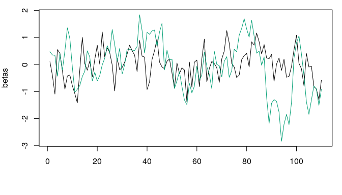

``` r
# simualte observations
cfix <- c(-1, .2, .5, -1) # gamma
n_obs <- 100L
dat <- lapply(1:n_obs, function(id){
  x <- runif(n_periods, -1, 1)
  X <- cbind(X1 = x, X2 = runif(1, -1, 1))
  z <- runif(n_periods, -1, 1)
  
  eta <- drop(cbind(1, X, z) %*% cfix + rowSums(cbind(1, z) * betas))
  y <- rpois(n_periods, lambda = exp(eta))
  
  # randomly drop some
  keep <- .2 > runif(n_periods)
  
  data.frame(y = y, X, Z = z, id = id, time_idx = 1:n_periods)[keep, ]
})
dat <- do.call(rbind, dat)

# show some properties 
nrow(dat)
```

    ## [1] 2267

``` r
head(dat)
```

    ##    y       X1      X2       Z id time_idx
    ## 7  0 -0.09531 -0.4899  0.2972  1        7
    ## 15 0  0.97242 -0.4899 -0.3414  1       15
    ## 16 1 -0.77700 -0.4899  0.6973  1       16
    ## 20 1  0.24525 -0.4899 -0.3047  1       20
    ## 22 0 -0.20661 -0.4899  0.9579  1       22
    ## 25 0  0.90989 -0.4899  0.4456  1       25

``` r
table(dat$y)
```

    ## 
    ##    0    1    2    3    4    5    6    7    8    9   11   15   18 
    ## 1465  519  163   72   20   12    4    4    4    1    1    1    1

### Log-Likelihood Approximations

Then we estimate a generalized linear model without random effects.

``` r
glm_fit <- glm(y ~ X1 + X2 + Z, poisson(), dat)
summary(glm_fit)
```

    ## 
    ## Call:
    ## glm(formula = y ~ X1 + X2 + Z, family = poisson(), data = dat)
    ## 
    ## Deviance Residuals: 
    ##    Min      1Q  Median      3Q     Max  
    ## -2.285  -0.962  -0.670   0.379   6.226  
    ## 
    ## Coefficients:
    ##             Estimate Std. Error z value   Pr(>|z|)    
    ## (Intercept)  -0.7345     0.0333  -22.07    < 2e-16 ***
    ## X1            0.2501     0.0487    5.14 0.00000028 ***
    ## X2            0.5395     0.0499   10.81    < 2e-16 ***
    ## Z            -1.1091     0.0530  -20.92    < 2e-16 ***
    ## ---
    ## Signif. codes:  0 '***' 0.001 '**' 0.01 '*' 0.05 '.' 0.1 ' ' 1
    ## 
    ## (Dispersion parameter for poisson family taken to be 1)
    ## 
    ##     Null deviance: 3358.1  on 2266  degrees of freedom
    ## Residual deviance: 2731.7  on 2263  degrees of freedom
    ## AIC: 4589
    ## 
    ## Number of Fisher Scoring iterations: 6

``` r
logLik(glm_fit)
```

    ## 'log Lik.' -2291 (df=4)

Next, we make a log-likelihood approximation with the implemented particle at the true parameters with the `mssm` function.

``` r
library(mssm)
ll_func <- mssm(
  fixed = y ~ X1 + X2 + Z, family = poisson(), data = dat, 
  # make it explict that there is an intercept (not needed)
  random = ~ 1 + Z, ti = time_idx, control = mssm_control(
    n_threads = 5L, N_part = 500L, what = "log_density", 
    seed = 2L))

system.time(
  mssm_obj <- ll_func$pf_filter(
    cfix = cfix, disp = numeric(), F. = F., Q = Q))
```

    ##    user  system elapsed 
    ##   0.772   0.015   0.199

``` r
# returns the log-likelihood approximation
logLik(mssm_obj)
```

    ## 'log Lik.' -2008 (df=NA)

As expected, we get a much higher log-likelihood. We can e.g., compare this to a model where we use splines instead for each of the two random effects.

``` r
# compare with GLM with spline
library(splines)
logLik(glm(y ~ X1 + X2 + Z * ns(time_idx, df = 20, intercept = TRUE)- 1, 
           poisson(), dat))
```

    ## 'log Lik.' -2007 (df=42)

We can plot the **filter** estimates.

``` r
# plot estiamtes 
filter_means <- plot(mssm_obj)
```

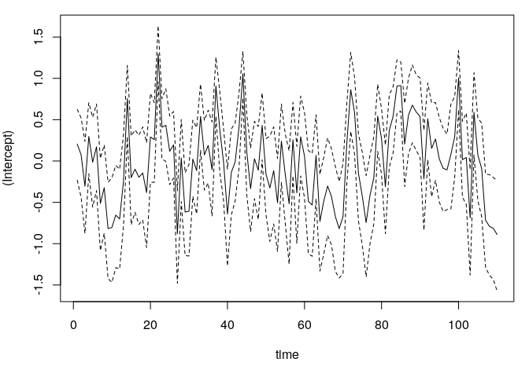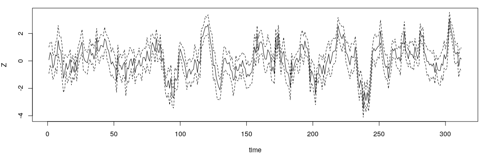

``` r
# plot with true line as well
for(i in 1:ncol(betas)){
  be <- betas[, i]
  me <- filter_means$means[i, ]
  lb <- filter_means$lbs[i, ]
  ub <- filter_means$ubs[i, ]
  
  # dashed: true line, continuous: filter estimate 
  # dotted: prediction interval
  par(mar = c(5, 4, 1, 1))
  matplot(cbind(be, me, lb, ub), lty = c(2, 1, 3, 3), type = "l", 
          col = "black", ylab = rownames(filter_means$lbs)[i])
}
```

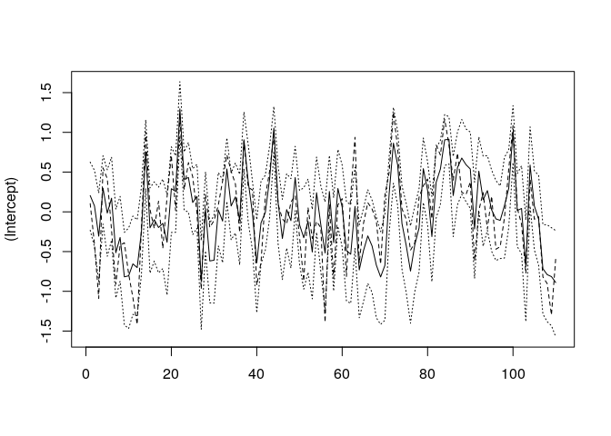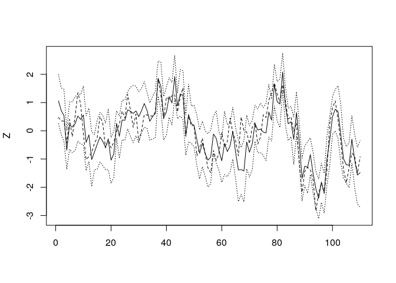

We can get the effective sample size at each point in time with the `get_ess` function.

``` r
(ess <- get_ess(mssm_obj))
```

    ## Effective sample size:
    ##   Mean      461.1
    ##   sd         13.2
    ##   Min       400.9
    ##   Max       481.8

``` r
plot(ess)
```

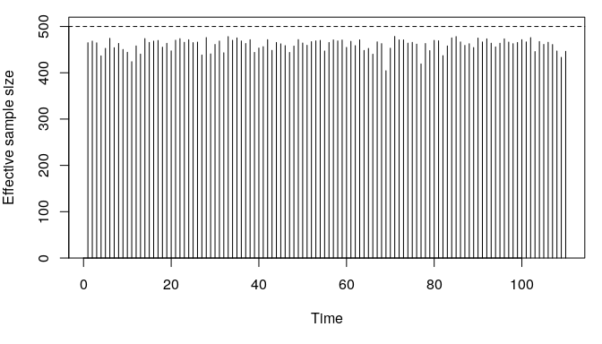

We can compare this what we get by using a so-called bootstrap (like) filter instead.

``` r
local({
  ll_boot <- mssm(
    fixed = y ~ X1 + X2 + Z, family = poisson(), data = dat, 
    # make it explict that there is an intercept (not needed)
    random = ~ 1 + Z, ti = time_idx, control = mssm_control(
      n_threads = 5L, N_part = 500L, what = "log_density", 
      seed = 2L, which_sampler = "bootstrap"))
  
  print(system.time(
    boot_fit <- ll_boot$pf_filter(
      cfix = coef(glm_fit), disp = numeric(), F. = F., Q = Q)))
  
  plot(get_ess(boot_fit))
})
```

    ##    user  system elapsed 
    ##   0.699   0.009   0.178

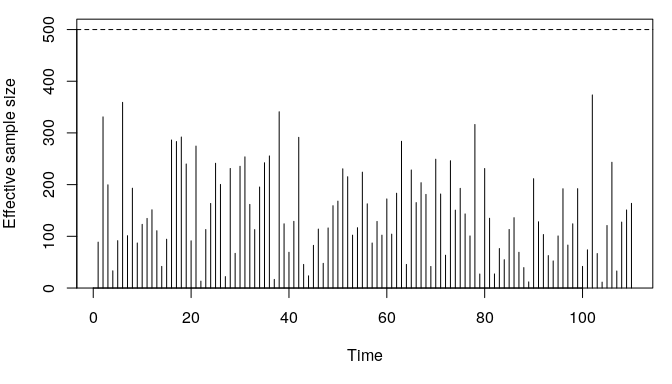

The above is not much faster (and maybe slower in this run) as the bulk of the computation is not in the sampling step. We can also compare the log-likelihood approximation with what we get if we choose parameters close to the GLM estimates.

``` r
mssm_glm <- ll_func$pf_filter(
  cfix = coef(glm_fit), disp = numeric(), F. = diag(1e-8, 2), 
  Q = diag(1e-4^2, 2))
logLik(mssm_glm)
```

    ## 'log Lik.' -2297 (df=NA)

TODO: I am not sure why we get a lower log-likelihood with the above.

### Parameter Estimation

We will need to estimate the parameter for real applications. We could do this e.g., with a Monte Carlo expectation-maximization algorithm or by using a Monte Carlo approximation of the gradient. Currently, the latter is only available and the user will have to write a custom function to perform the estimation. I will provide an example below. The `sgd` function is not a part of the package. Instead the package provides a way to approximate the gradient and allows the user to perform subsequent maximization. The definition of the `sgd` is given at the end of this file as it is somewhat long.

``` r
# setup mssmFunc object to use
ll_func <- mssm(
  fixed = y ~ X1 + X2 + Z, family = poisson(), data = dat, 
  # make it explict that there is an intercept (not needed)
  random = ~ 1 + Z, ti = time_idx, control = mssm_control(
    n_threads = 5L, N_part = 100L, what = "gradient", 
    seed = 2L))

# use stochastic gradient descent
system.time(
  res <- sgd(
    ll_func, F. = diag(.1, 2), Q = diag(.1^2, 2), cfix = coef(glm_fit)))
```

    ##    user  system elapsed 
    ##  59.987   1.008  15.482

Plot the approximate log-likelihoods at each iteration and show the final estimates.

``` r
tail(res$logLik, 1L) # final log-likelihood approximation
```

    ## [1] -2007

``` r
par(mar = c(5, 4, 1, 1))
plot(     res$logLik       , type = "l")
```

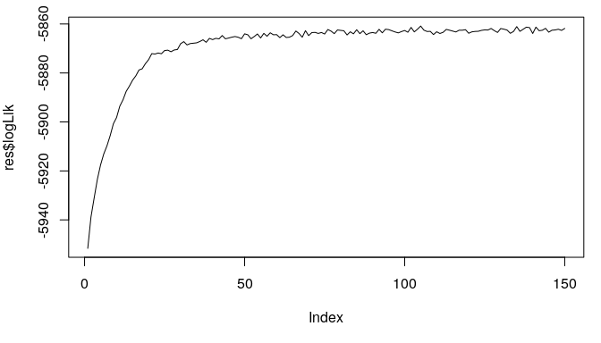

``` r
plot(tail(res$logLik, 100L), type = "l") # only the final iterations
```

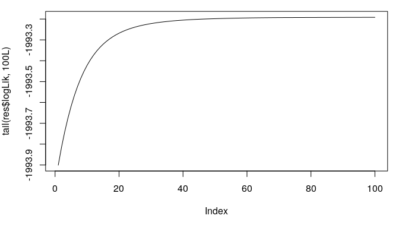

``` r
# final estimates
res$F. 
```

    ##          [,1]   [,2]
    ## [1,]  0.35275 0.0556
    ## [2,] -0.02201 0.8060

``` r
res$Q
```

    ##         [,1]    [,2]
    ## [1,] 0.30418 0.05624
    ## [2,] 0.05624 0.34139

``` r
res$cfix
```

    ## [1] -1.0091  0.2152  0.5168 -1.0651

Fast Sum-Kernel Approximation
-----------------------------

This package contains a simple implementation of the dual-tree method like the one suggested by Gray and Moore (2003) and shown in Klaas et al. (2006). It is currently not used in the particle filters but will be in the future. The problem we want to solve is the sum-kernel problem in Klaas et al. (2006). Particularly, we consider the situation where we have  query particles denoted by  and  source particles denoted by . For each query particle, we want to compute the weights

")

where each source particle has an associated weight  and  is a kernel. Computing the above is ") which is major bottleneck if  and  is large. However, one can use a [k-d tree](https://en.wikipedia.org/wiki/K-d_tree) for the query particles and source particles and exploit that:

-   ") is almost zero for some pairs of nodes in the two k-d trees.
-   ") is almost identical for some nodes in the k-d tree for the source particles.

Thus, a substantial amount of computation can be skipped or approximated with e.g., the centroid in the source node with only a minor loss of precision. The dual-tree approximation method is ") and "). We start by defining a function to simulate the source and query particles (we will let the two sets be identical for simplicity). Further, we plot one draw of simulated points and illustrate the leafs in the k-d tree.

``` r
######
# define function to simulate data
mus <- matrix(c(-1, -1, 
                 1, 1, 
                -1, 1), 3L, byrow = FALSE)
mus <- mus * .75
Sig <- diag(c(.5^2, .25^2))

get_sims <- function(n_per_grp){
  # simulate X
  sims <- lapply(1:nrow(mus), function(i){
    mu <- mus[i, ]
    X <- matrix(rnorm(n_per_grp * 2L), nrow = 2L)
    X <- t(crossprod(chol(Sig), X) + mu)
    
    data.frame(X, grp = i)
  })
  sims <- do.call(rbind, sims)
  X <- t(as.matrix(sims[, c("X1", "X2")]))
  
  # simulate weights
  ws <- exp(rnorm(ncol(X)))
  ws <- ws / sum(ws)
  
  list(sims = sims, X = X, ws = ws)
}

#####
# show example 
set.seed(42452654)
invisible(list2env(get_sims(5000L), environment()))

# plot points
par(mar = c(5, 4, .5, .5))
plot(as.matrix(sims[, c("X1", "X2")]), col = sims$grp + 1L)

# find KD-tree and add borders 
out <- mssm:::test_KD_note(X, 50L)
out$indices <- out$indices + 1L
n_ele <- drop(out$n_elems)
idx <- mapply(`:`, cumsum(c(1L, head(n_ele, -1))), cumsum(n_ele))
stopifnot(all(sapply(idx, length) == n_ele))
idx <- lapply(idx, function(i) out$indices[i])
stopifnot(!anyDuplicated(unlist(idx)), length(unlist(idx)) == ncol(X))

grps <- lapply(idx, function(i) X[, i])

borders <- lapply(grps, function(x) apply(x, 1, range))
invisible(lapply(borders, function(b) 
  rect(b[1, "X1"], b[1, "X2"], b[2, "X1"], b[2, "X2"])))
```

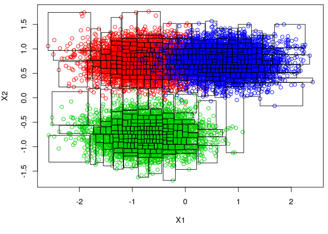

Next, we compute the run-times for the previous examples and compare the approximations of the un-normalized log weights, , and normalized weights, . The `n_threads` sets the number of threads to use in the methods.

``` r
# run-times
microbenchmark::microbenchmark(
  `dual tree 1` = mssm:::FSKA (X = X, ws = ws, Y = X, N_min = 10L, 
                               eps = 5e-3, n_threads = 1L),
  `dual tree 6` = mssm:::FSKA (X = X, ws = ws, Y = X, N_min = 10L, 
                               eps = 5e-3, n_threads = 4L),
  `naive 1`     = mssm:::naive(X = X, ws = ws, Y = X, n_threads = 1L),
  `naive 6`     = mssm:::naive(X = X, ws = ws, Y = X, n_threads = 4L),
  times = 10L)
```

    ## Unit: milliseconds
    ##         expr     min      lq    mean  median      uq     max neval
    ##  dual tree 1  112.60  114.45  118.27  115.88  119.01  138.05    10
    ##  dual tree 6   41.18   42.13   46.26   43.47   52.61   53.61    10
    ##      naive 1 3322.36 3367.28 3451.26 3464.88 3503.88 3616.26    10
    ##      naive 6  941.73  954.22 1005.04  963.05 1059.27 1135.02    10

``` r
# The functions return the un-normalized log weights. We first compare
# the result on this scale
o1 <- mssm:::FSKA  (X = X, ws = ws, Y = X, N_min = 10L, eps = 5e-3, 
                    n_threads = 1L)
o2 <- mssm:::naive(X = X, ws = ws, Y = X, n_threads = 4L)

all.equal(o1, o2)
```

    ## [1] "Mean relative difference: 0.0015"

``` r
par(mar = c(5, 4, .5, .5))
hist((o1 - o2)/ abs((o1 + o2) / 2), breaks = 50, main = "", 
     xlab = "Delta un-normalized log weights")
```

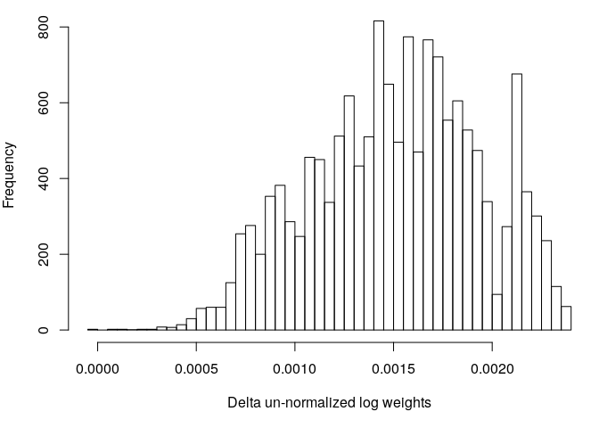

``` r
# then we compare the normalized weights
func <- function(x){
  x_max <- max(x)
  x <- exp(x - x_max)
  x / sum(x)
}

o1 <- func(o1)
o2 <- func(o2)
all.equal(o1, o2)
```

    ## [1] "Mean relative difference: 0.0008531"

``` r
hist((o1 - o2)/ abs((o1 + o2) / 2), breaks = 50, main = "", 
     xlab = "Delta normalized log weights")
```

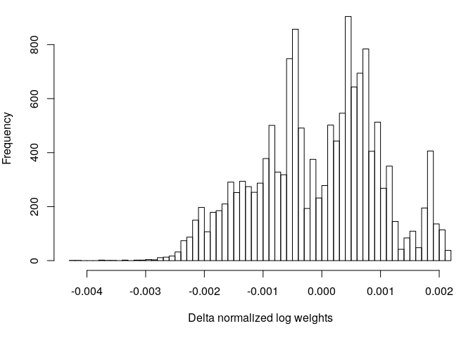

Finally, we compare the run-times as function of . The dashed line is "naive" method, the continuous line is the dual-tree method, and the dotted line is dual-tree method using 1 thread.

``` r
Ns <- 2^(7:14)
run_times <- lapply(Ns, function(N){
  invisible(list2env(get_sims(N), environment()))
  microbenchmark::microbenchmark(
    `dual-tree`   = mssm:::FSKA (X = X, ws = ws, Y = X, N_min = 10L, eps = 5e-3, 
                                 n_threads = 4L),
    naive         = mssm:::naive(X = X, ws = ws, Y = X, n_threads = 4L),
    `dual-tree 1` = mssm:::FSKA (X = X, ws = ws, Y = X, N_min = 10L, eps = 5e-3, 
                                 n_threads = 1L), 
    times = 5L)
})

Ns_xtra <- 2^(15:19)
run_times_xtra <- lapply(Ns_xtra, function(N){
  invisible(list2env(get_sims(N), environment()))
  microbenchmark::microbenchmark(
    `dual-tree` = mssm:::FSKA (X = X, ws = ws, Y = X, N_min = 10L, eps = 5e-3, 
                               n_threads = 4L),
    times = 5L)
})
```

``` r
library(microbenchmark)
meds <- t(sapply(run_times, function(x) summary(x, unit = "s")[, "median"]))
meds_xtra <- 
  sapply(run_times_xtra, function(x) summary(x, unit = "s")[, "median"])
meds <- rbind(meds, cbind(meds_xtra, NA_real_, NA_real_))
dimnames(meds) <- list(
  N = c(Ns, Ns_xtra) * 3L, method = c("Dual-tree", "Naive", "Dual-tree 1"))
meds
```

    ##          method
    ## N         Dual-tree     Naive Dual-tree 1
    ##   384      0.001713  0.001186    0.004205
    ##   768      0.003232  0.002979    0.008134
    ##   1536     0.005331  0.010871    0.014012
    ##   3072     0.009384  0.038602    0.025541
    ##   6144     0.022175  0.174188    0.053972
    ##   12288    0.044357  0.655904    0.109632
    ##   24576    0.065755  2.634866    0.190534
    ##   49152    0.131258 10.634452    0.393239
    ##   98304    0.258856        NA          NA
    ##   196608   0.511701        NA          NA
    ##   393216   1.095187        NA          NA
    ##   786432   2.327251        NA          NA
    ##   1572864  4.631362        NA          NA

``` r
par(mar = c(5, 4, .5, .5))
matplot(c(Ns, Ns_xtra) * 3L, meds, lty = 1:3, type = "l", log = "xy", 
        ylab = "seconds", xlab = "N", col = "black")
```

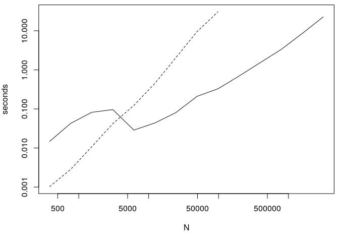

Function Definitions
--------------------

``` r
# Stochastic gradient descent for mssm object. The function assumes that the 
# state vector is stationary. The default values are rather arbitrary.
# 
# Args:
#   object: an object of class mssmFunc. 
#   n_it: number of iterations. 
#   lrs: learning rates to use. Must have n_it elements. Like problem specific. 
#   avg_start: index to start averaging. See Polyak et al. (1992) for arguments
#              for averaging.
#   cfix: starting values for fixed coefficients. 
#   F.: starting value for transition matrix in conditional distribution of the 
#       current state given the previous state.
#   Q: starting value for covariance matrix in conditional distribution of the 
#      current state given the previous. 
#   verbose: TRUE if output should be printed doing estmation. 
# 
# Returns:
#   List with estimates and the log-likelihood approximation at each iteration. 
sgd <- function(
  object, n_it = 150L, 
  lrs = 1e-3 * c(rep(1L, 49), ((50:n_it) - 40)^(-1/2)), avg_start = 100L,
  cfix, F., Q,  verbose = FALSE)
{
  # make checks
  stopifnot(
    inherits(object, "mssmFunc"), object$control$what == "gradient", n_it > 0L, 
    all(lrs > 0.), avg_start > 1L, length(lrs) == n_it)
  n_fix <- nrow(object$X)
  n_rng <- nrow(object$Z)
  
  # objects for estimates at each iteration and log-likelihood approximations
  ests <- matrix(
    NA_real_, n_it + 1L, n_fix + n_rng * n_rng + n_rng * (n_rng  + 1L) / 2L)
  ests[1L, ] <- c(cfix, F., Q[lower.tri(Q, diag = TRUE)])
  lls <- rep(NA_real_, n_it)
  
  # indices of the different components
  idx_fix <- 1:n_fix
  idx_F   <- 1:(n_rng * n_rng) + n_fix
  idx_Q   <- 1:(n_rng * (n_rng  + 1L) / 2L) + n_fix + n_rng * n_rng
  
  # we only want the lower part of `Q` so we make the following map for the 
  # gradient
  library(matrixcalc) # TODO: get rid of this
  gr_map <- matrix(
    0., nrow = ncol(ests), ncol = length(cfix) + length(F.) + length(Q))
  gr_map[idx_fix, idx_fix] <- diag(length(idx_fix))
  gr_map[idx_F  , idx_F] <- diag(length(idx_F))
  dup_mat <- duplication.matrix(ncol(Q))
  gr_map[idx_Q  , -c(idx_fix, idx_F)] <- t(dup_mat)
  
  # function to set the parameters
  set_parems <- function(i){
    # select whether or not to average
    idx <- if(i > avg_start) avg_start:i else i
    
    # set new parameters
    cfix <<-             colMeans(ests[idx, idx_fix, drop = FALSE])
    F.[] <<-             colMeans(ests[idx, idx_F  , drop = FALSE])
    Q[]  <<- dup_mat %*% colMeans(ests[idx, idx_Q  , drop = FALSE])
    
  }
    
  # run gradient decent 
  max_half <- 25L
  for(i in 1:n_it + 1L){
    # get gradient. First, run the particle filter
    filter_out <- object$pf_filter(cfix = cfix, disp = numeric(), F. = F., Q = Q)
    lls[i - 1L] <- c(logLik(filter_out))
    
    # then get the gradient associated with each particle and the log 
    # normalized weight of the particles
    grads <- tail(filter_out$pf_output, 1L)[[1L]]$stats
    ws    <- tail(filter_out$pf_output, 1L)[[1L]]$ws_normalized
    
    # compute the gradient and take a small step
    grad <- colSums(t(grads) * drop(exp(ws)))
    lr_i <- lrs[i - 1L]
    k <- 0L
    while(k < max_half){
      ests[i, ] <- ests[i - 1L, ] + lr_i * gr_map %*% grad 
      set_parems(i)
      
      # check that Q is positive definite and the system is stationary
      c1 <- all(abs(eigen(F.)$values) < 1)
      c2 <- all(eigen(Q)$values > 0)
      if(c1 && c2)
        break
      
      # decrease learning rate
      lr_i <- lr_i * .5
      k <- k + 1L
    }
    
    # check if we failed to find a value within our constraints
    if(k == max_half)
      stop("failed to find solution within constraints")
    
    # print information if requested 
    if(verbose && (i - 2L) %% 20L == 0L){
      cat(sprintf(
        "\nIt %5d: log-likelihood (current, max) %12.2f, %12.2f\n", 
        i - 1L, logLik(filter_out), max(lls, na.rm = TRUE)), 
          rep("-", 66), "\n", sep = "")
      cat("cfix\n")
      print(cfix)
      cat("F\n")
      print(F.)
      cat("Q\n")
      print(Q)
      
    }
  } 
  
  list(estimates = ests, logLik = lls, F. = F., Q = Q, cfix = cfix)
}
```

References
==========

Gray, Alexander G., and Andrew W. Moore. 2003. “Rapid Evaluation of Multiple Density Models.” In *AISTATS*.

Klaas, Mike, Mark Briers, Nando de Freitas, Arnaud Doucet, Simon Maskell, and Dustin Lang. 2006. “Fast Particle Smoothing: If I Had a Million Particles.” In *Proceedings of the 23rd International Conference on Machine Learning*, 481–88. ICML ’06. New York, NY, USA: ACM. <http://doi.acm.org/10.1145/1143844.1143905>.

Lin, Ming T, Junni L Zhang, Qiansheng Cheng, and Rong Chen. 2005. “Independent Particle Filters.” *Journal of the American Statistical Association* 100 (472). Taylor & Francis: 1412–21. doi:[10.1198/016214505000000349](https://doi.org/10.1198/016214505000000349).

Polyak, B., and A. Juditsky. 1992. “Acceleration of Stochastic Approximation by Averaging.” *SIAM Journal on Control and Optimization* 30 (4): 838–55. doi:[10.1137/0330046](https://doi.org/10.1137/0330046).

Poyiadjis, George, Arnaud Doucet, and Sumeetpal S. Singh. 2011. “Particle Approximations of the Score and Observed Information Matrix in State Space Models with Application to Parameter Estimation.” *Biometrika* 98 (1). Biometrika Trust: 65–80. <http://www.jstor.org/stable/29777165>.
